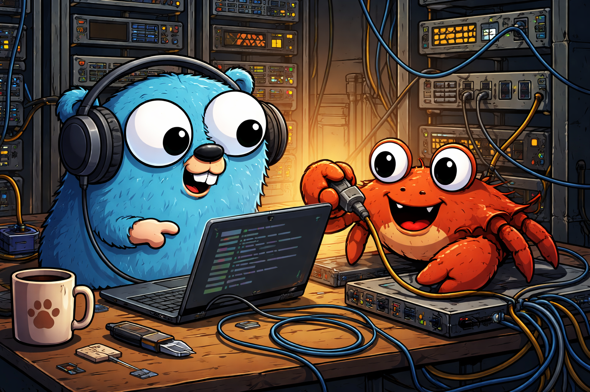

<p align="center">
  
</p>

# rsnet

Rust bindings for Tailscale's [libtailscale](https://github.com/tailscale/libtailscale) C library. Embed a Tailscale node directly into your Rust process — get an IP on your tailnet entirely from userspace, no system daemon required.

Fully async (tokio). Streams implement `AsyncRead + AsyncWrite + Unpin`.

## Prerequisites

- **Go** (to compile libtailscale from the git submodule)
- **Rust stable** (edition 2021+)
- A [Tailscale auth key](https://login.tailscale.com/admin/settings/keys)

```
git clone --recurse-submodules https://github.com/wowjeeez/rsnet.git
```

## Quick start

```rust
let mut server = RawTsTcpServer::new("my-node")?;
server.set_auth_key("tskey-auth-...")?;
server.set_dir("/var/lib/my-node")?;
server.up()?;

let listener = server.listen("tcp", ":80")?;
loop {
    let stream = listener.accept().await?;
    println!("peer: {:?}, port: {:?}", stream.peer_addr(), stream.local_port());
    tokio::spawn(handle_connection(stream));
}
```

## TLS

Go handles TLS + ACME certs natively — no rustls needed:

```rust
let listener = server.listen_native_tls("tcp", ":443")?;
let stream = listener.accept().await?; // already decrypted
```

## Services

Multi-port Tailscale Services with a builder pattern:

```rust
let mut svc = server.service("svc:my-api")
    .https(443)
    .http(80)
    .tcp(9000)
    .bind()?;

println!("fqdn: {}", svc.fqdn);

loop {
    let (port, stream) = svc.accept().await?;
    tokio::spawn(async move {
        match port {
            443 => handle_https(stream).await,
            80 => handle_http(stream).await,
            9000 => handle_tcp(stream).await,
            _ => {}
        }
    });
}
```

Note: services require a tagged auth key (create in admin console with e.g. `tag:service`).

## LocalAPI

Typed access to Tailscale's node-local HTTP API:

```rust
let client = server.local_client()?;

let me = client.whoami().await?;
let domain = client.fqdn().await?;
let status = client.status().await?;
let who = client.whois("100.x.y.z:443").await?;
let prefs = client.prefs().await?;

let (cert, key) = client.cert_pair("my-node.tailnet.ts.net").await?;

client.advertise_exit_node().await?;
client.advertise_routes(&["10.0.0.0/8"]).await?;
client.set_tags(&["tag:server"]).await?;

let (code, body) = client.get("/localapi/v0/status").await?;
```

## Stream API

`TailscaleStream` mirrors `tokio::TcpStream`:

```rust
let stream = listener.accept().await?;

stream.peer_addr()              // Option<&str>
stream.local_port()             // Option<u16>
stream.readable().await?;       // wait for readable
stream.writable().await?;       // wait for writable
stream.try_read(&mut buf)?;     // non-blocking
stream.try_write(b"hello")?;    // non-blocking

// async read/write via AsyncReadExt/AsyncWriteExt
stream.read_exact(&mut buf).await?;
stream.write_all(b"hello").await?;

// split for bidirectional
let (reader, writer) = tokio::io::split(stream);
```

## Examples

```bash
# plain HTTP on port 80
cargo run --example hello -- <auth-key> <hostname>

# HTTPS with native TLS on port 443
cargo run --example hello_tls -- <auth-key> <hostname>

# multi-port service (requires tagged auth key)
cargo run --example service -- <auth-key> <hostname> svc:my-api
```

## Logging

Go-side logs are piped through `tracing` at debug level with target `libtailscale`:

```
RUST_LOG=libtailscale=debug cargo run --example hello -- ...
```

## State persistence

Set a state directory to avoid re-authentication on every restart:

```rust
server.set_dir("/var/lib/my-node")?;
```

Without this, libtailscale uses a default path keyed by binary name. Combined with `set_ephemeral(true)`, the node is deleted from your tailnet when the process exits and needs re-auth next run.
